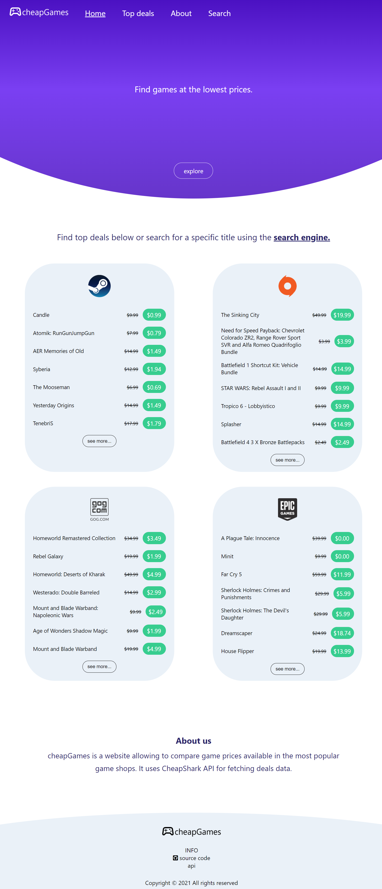

# cheapGames

## Description

[See live](https://janskiba.github.io/cheapGames/)

cheapGames is a game price comparison website built with HTML, SCSS and Vanilla JavaScript (no frameworks). It uses [CheapShark API](https://apidocs.cheapshark.com "CheapShark API") for fetching games data.

Index page contains top deals of games available in shops such as: Steam, Origin, GOG and Epic Games.

To search for a specific title use the search engine. Once a title is found, click on the see offers button to expand the list of shops. Each listed shop is a link navigating to that particular offer. 

## Screenshots

### Index page

### Search page

